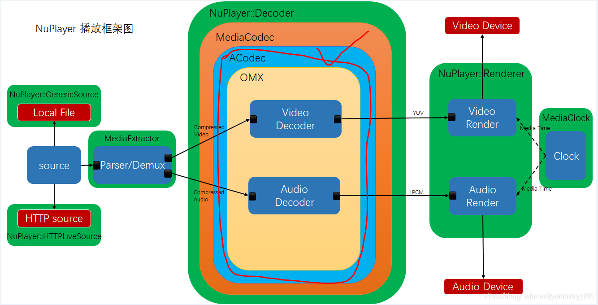
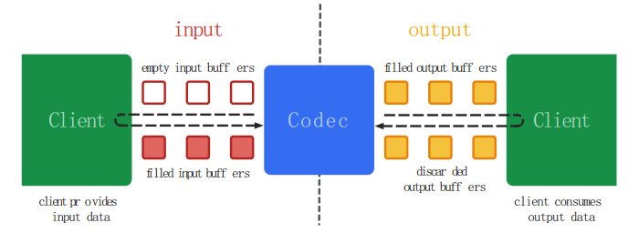
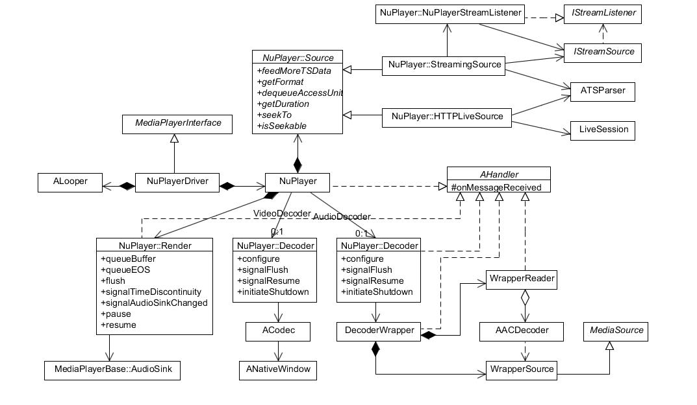
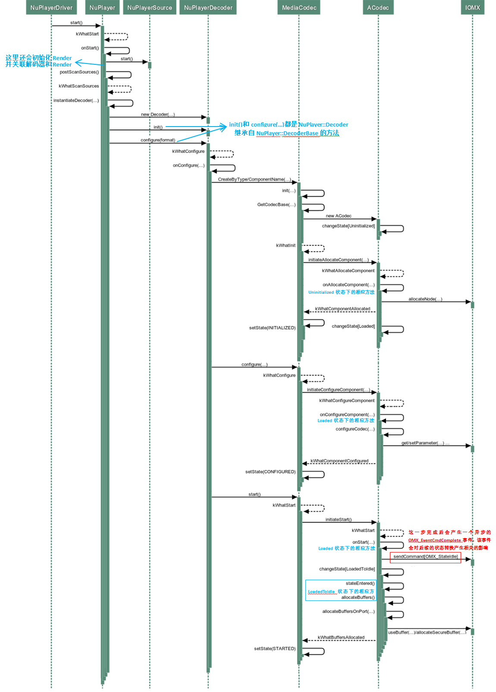
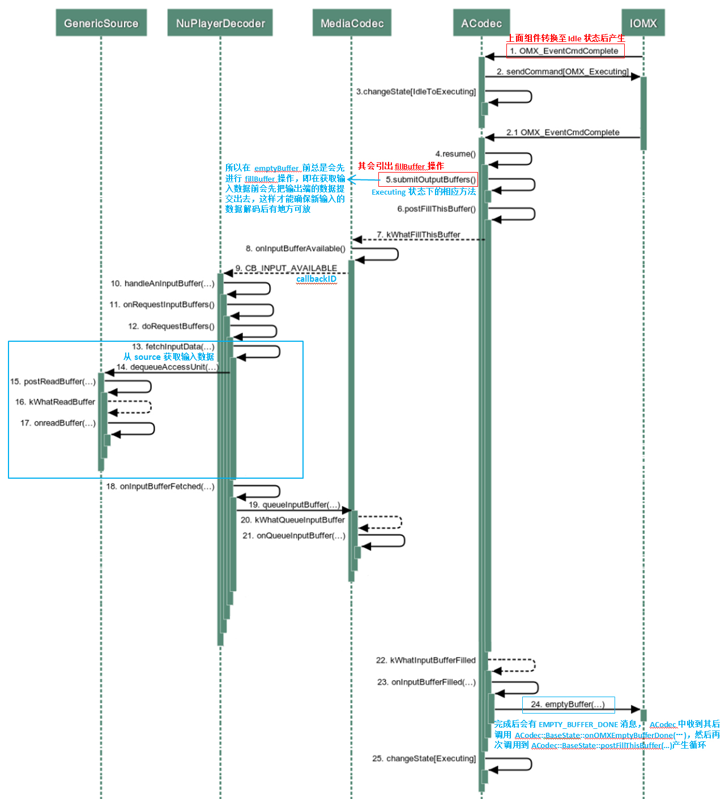
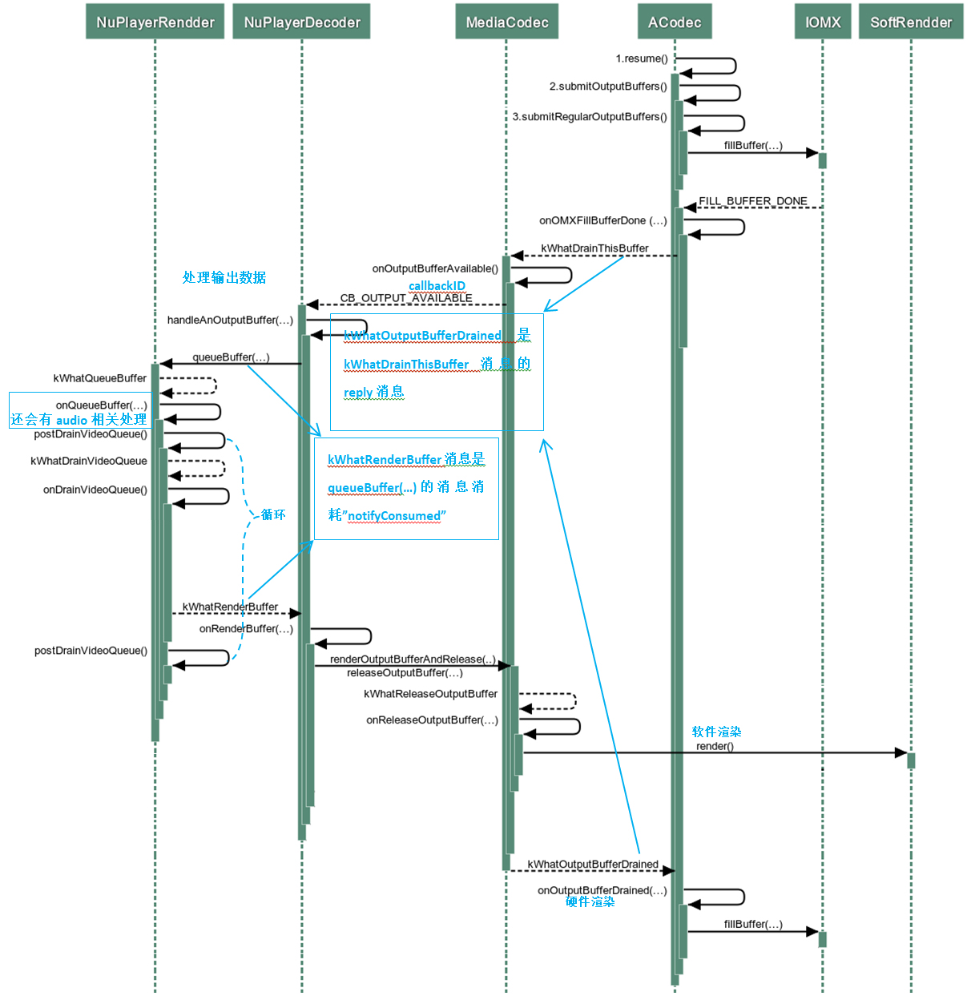
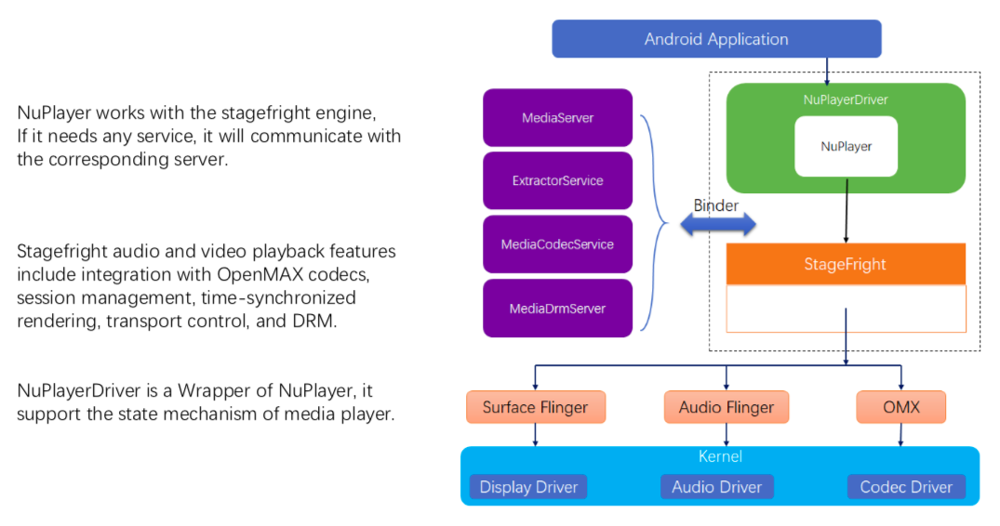
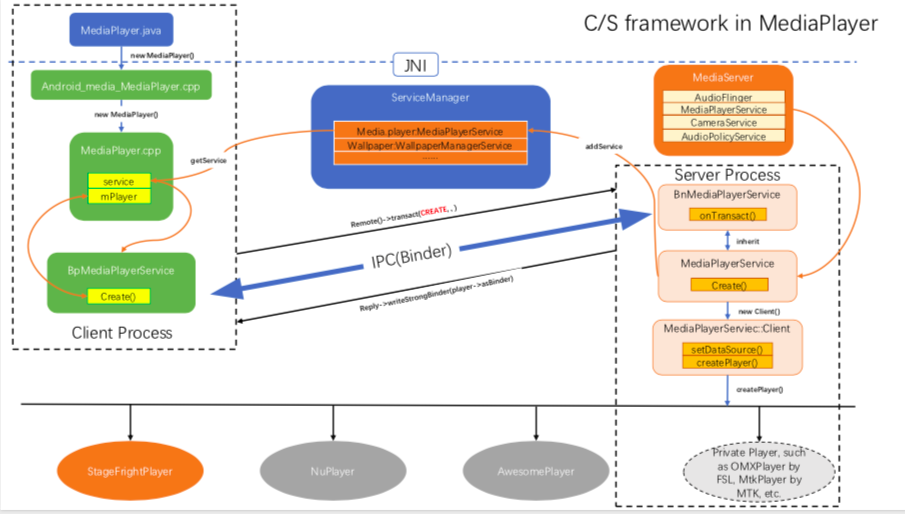

## 架构资料

[架构参考资料](Android_MultiMedia_ybx.pdf)


---

NuPlayer部分，关注NuPlayer这一播放器引擎的概要实现

---


## NuPlayer系统构成




**NuPlayerDecoder**

> 对MediaCodec的封装，MediaCodec又进而使用ACodec，完成了解码的逻辑控制，真正的解码在OMX中

**NuPlayerSource**

> 封装了数据源读取、Parse/Demux的功能，它对外输出音频压缩数据和视频压缩数据。源文件是将Audio和Video压缩数据后加上metadata，Demux功能就是读取metadata，从其中抽取audio/video压缩数据流，送入NuPlayerDecoder

**NuPlayerRenderer**

> 控制音视频的输出
Renderer的作用就是根据传过来数据帧的时间来判断这一帧是否需要渲染，并进行音视频的同步。但是真正硬件渲染的代码在MediaCodec和ACodec中

**Tips**
> NuPlayer、NuPlayerDecoder、NuPlayerRenderer、NuPlayerSource配合实现了**播放器框架**，它不涉及具体的编码、Mux、Demux、Render具体处理逻辑，主要是完成控制流逻辑，NuPlayer是一个连接器，构建NuPlayer**各个组件的连接和通信。

> NuPlayer利用MediaCodec、MediaExtrator、MediaMux等组件提供的软硬件统一抽象接口，为MediaPlayService提供具体的播放接口实现(setDataSource->prepare->start->seek->pause->stop...)

> MediaPlayService实现了多种播放器的路由选择，比如Android7.0之前AwesomePlayer(local file)、NuPlayer(rtsp、http)的选择与适配。


---
### 核心组件MediaCodec

官方参考资料：MeidaCodec API: https://developer.android.com/reference/android/media/MediaCodec

官方的虽然是Java的，但是从实现上，Java是对Native的简单封装，其接口的功能未变化，所以可以参考

MediaCodec是一个Codec，通过硬件加速解码和编码。它为芯片厂商和应用开发者搭建了一个统一接口。MediaCodec几乎是所有安卓播放器硬解的标配，它同MediaExtractor、MediaMuxer等构成NDK级别的接口层，在MediaCodec内部使用ACodec实现具体的数据解码处理。MediaCodec是可以独立使用的，只要按照接口的调用要求来调用

MediaCodec可以处理的数据有以下三种类型：压缩数据、原始音频数据、原始视频数据。这三种类型的数据均可以利用ByteBuffers进行处理，但是对于原始视频数据应提供一个Surface以提高编解码器的性能。Surface直接使用native视频数据缓存，而没有映射或复制它们到ByteBuffers，因此，这种方式会更加高效。

MediaCodec采用异步方式处理数据，并且使用了一组输入输出缓存（ByteBuffer）。通过请求一个空的输入缓存（ByteBuffer），向其中填充满数据并将它传递给编解码器处理。编解码器处理完这些数据并将处理结果输出至一个空的输出缓存（ByteBuffer）中。使用完输出缓存的数据之后，将其释放回编解码器：示意图如下。MediaCodec将Codec和输入·输出Buffer作为一个统一概念来管理



---
### 组件图



### mainUseCase

通过查询网络上已经有的时序图，能够基本清晰的看到完整的主要时序
这里主要关注NuPlayer**组件间的互动，而NuPlayerDecoder和MediaCodec等的互动不作为重点

**初始化流程**



* NuPlayerDriver
  提供了同期接口和状态机管理
* NuPlayer
  面向NuPlayerDriver提供了异步接口函数，在异步接口函数内部，使用AMessage\AHandler\ALooper的处理机制来提供异步
* NuPlayer启动过程中
  * 调用NuPlayerSource的Start函数
  * 调用NuPlayerDecoder的Init和Configure函数，进而调用CreateByType/CreateByComponentName来创建MediaCodec

**emptyBuffer**

* NuPlayerDecoder受到MediaCodec触发(CB_INPUT_AVAILABLE),开始准备数据，准备完成后调用MediaCodec的queueInputBuffer接口送入数据，这个CB_INPUT_AVAILABLE是NuPlayerDecoder自主定义的，代表着MediaCodec的数据请求
* NuPlayerDecoder和NuPlayerSource(GenericSource/StreamSource/HttpSource)交互(通过dequeueAccessUnit)，在onInputBufferFetched中响应数据准备完成的请求
* NuPlayerSource做数据准备动作



* 数据量:只要能从MediaCodec申请到InputBuffer就可以送入


**fillbuffer**

* NuPlayerDecoder收到MediaCodec触发的CB_OUTPUT_AVAILABLE通知，了解MediaCodec已经完成了部分数据的解码操作，即在OutputBuffer中可以获取到解码后的数据，
* 通知NuPlayerRenderer做准备，获取解码后的数据，进行下一步的渲染动作。
* 当数据被NuPlayerRenderer读取完成后，NuPlayerDecoder会调用releaseOutputBuffer，通知MediaCodec数据已经消费完，outputBuffer可以继续使用了。




### 总结

> emptyBuffer和fillBuffer的处理流程中，在从Source向Decoder准备数据的时候，会拷贝压缩的音频/视频数据。在解码完成后，未压缩的视频/音频数据，数据量是很大，这里没有发生数据拷贝动作，这里只是获取数据的元数据信息，完成数据流的控制。所以到解码完成后的数据渲染处理都是在MediaCodec->ACodec和OMX以及Surface等的配置来实现的


> NuPlayer的实现逻辑由四个部分构成
> * 初始化构建，启动、停止、Seek的控制指令实现
> * 播放过程中，会完全由MediaCodec作为核心引擎来驱动emptyBuffer和fillBuffer过程
> * 在播放过程中响应异常处理，解码错误、EOS等
> * 在播放过程中的音视频同步控制逻辑


---

多媒体框架部分，从整体上来分析Android的MediaFramework

---

## 多媒体框架


### C-S架构



* MediaplayerService实现了bind服务端，NDK和SDK(JNI)为bind客户端
* MediaPlayerService主要实现了NuPlayer，同时动态链接stageFright库(使用mediacodec、acodec等组件接口)。真正在底层干活的如MediaCodecService，SurfaceFlinger，AudioFlinger，MediaExtractorService又以bind服务的形式提供
* Android Application使用NDK、SDK来实现Media访问


### Client端(MediaNDK)

**依赖库构成**
```
LOCAL_SHARED_LIBRARIES := \
    libbinder \
    libmedia \ 这里可以暂时理解到libmedia提供的bindproxy，仍然会被NDK使用
    libmediadrm \
    libstagefright \
    libstagefright_foundation \
    liblog \
    libutils \
    libcutils \
    libandroid_runtime \
    libbinder \
    libgui \
    libui \
```
**NDK对外提供的组件**

* MediaCrypto
* MediaCodec
* MediaDrm
* MediaExtrator
* MediaFormat
* MediaMuxer

NDK使用libstagefright里的组件来实现NDK的Media**组件，比如MediaCodec，可以在代码中看到有明确的
sp<android::MediaCodec> mCodec的封装引用。
```
struct AMediaCodec {
    sp<android::MediaCodec> mCodec;★★★
    sp<ALooper> mLooper;
    sp<CodecHandler> mHandler;
    sp<AMessage> mActivityNotification;
    int32_t mGeneration;
    bool mRequestedActivityNotification;
    OnCodecEvent mCallback;
    void *mCallbackUserData;
};
```

### Client端(libMedia_jni(JDK))

base/media/jni/*

**依赖的库列表**

LOCAL_SHARED_LIBRARIES := \
    libandroid_runtime \
    libnativehelper \
    libutils \
    libbinder \
    libmedia \
    libmediadrm \
    libskia \
    libui \
    liblog \
    libcutils \
    libgui \
    libstagefright \
    libstagefright_foundation \
    libcamera_client \
    libmtp \
    libusbhost \
    libexif \
    libpiex \
    libstagefright_amrnb_common

**JDK对外开放的接口**

JDK(JNI)和NDK类似，即开放了MediaPlayer等统合的接口，也开放的基础的组件接口如MediaCodec

* android_media_MediaCodec：这里依赖了libstagefright中的MediaCodec
* android_media_MediaCodecList
* android_media_MediaCrypto
* android_media_MediaDataSource
* android_media_MediaDrm
* android_media_MediaExtractor
* android_media_MediaMuxer
* android_media_MediaPlayer:这里依赖了libMedia中的mediaplayer
* android_media_MediaRecorder
* android_media_MediaScanner
* android_media_MediaSync

tips:
> 通过查看**native_setup查看new出来的对象是哪个类的，进而决定其具体实现
> 通过查看JNI_onLoad,可以查看Java里面的接口和android_media_***之间的接口映射关系


### C-S端通信(bind)

问题：MediaPlayer怎么实现的通信呢？

**media.player的Client构建**

android_media_MediaPlayer中调用了new MediaPlayer

MediaPlayer的声明
```
class MediaPlayer : public BnMediaPlayerClient,
                    public virtual IMediaDeathNotifier
```

后续的接口如setVideoSurface、prepare都是调用的MediaPlayer的对应接口

这里以setDataSource为例：


``` cpp

status_t MediaPlayer::setDataSource(
        const sp<IMediaHTTPService> &httpService,
        const char *url, const KeyedVector<String8, String8> *headers)
{
    ALOGV("setDataSource(%s)", url);
    status_t err = BAD_VALUE;
    if (url != NULL) {
        const sp<IMediaPlayerService> service(getMediaPlayerService());
        if (service != 0) {
            sp<IMediaPlayer> player(service->create(this, mAudioSessionId));
            if ((NO_ERROR != doSetRetransmitEndpoint(player)) ||
                (NO_ERROR != player->setDataSource(httpService, url, headers))) {
                player.clear();
            }
            err = attachNewPlayer(player);
        }
    }
    return err;
}
```

这里关键的const sp<IMediaPlayerService> service(getMediaPlayerService());，这里构建IMediaPlayerService，进而使用IMediaPlayerService的create函数来创建player。
*目前函数调用还处于jni的Context内*

查看getMediaPlayerService，就是访问defaultServiceManager，获取到media.player的bind客户端
进而建立和MediaPlayerService的bind关联

``` cpp
/*static*/const sp<IMediaPlayerService>
IMediaDeathNotifier::getMediaPlayerService()
{
    ALOGV("getMediaPlayerService");
    Mutex::Autolock _l(sServiceLock);
    if (sMediaPlayerService == 0) {
        sp<IServiceManager> sm = defaultServiceManager();
        sp<IBinder> binder;
        do {
            binder = sm->getService(String16("media.player"));
            if (binder != 0) {
                break;
            }
            ALOGW("Media player service not published, waiting...");
            usleep(500000); // 0.5 s
        } while (true);

        if (sDeathNotifier == NULL) {
            sDeathNotifier = new DeathNotifier();
        }
        binder->linkToDeath(sDeathNotifier);
        sMediaPlayerService = interface_cast<IMediaPlayerService>(binder);
    }
    return sMediaPlayerService;
}
```

经过上述处理，建立了MediaPlayer的Client端，参考下面的服务端，mediaServer能够看到，在mediaServer启动的时候，注册了mediaplayerservice的bind服务。



※我目前解析的结果和图中的稍有偏差，不影响当前的理解，暂时不再深究


### Server端(mediaServer))

av/media/mediaserver/main_mediaserver.cpp

``` cpp
int main(int argc __unused, char **argv __unused)
{
    signal(SIGPIPE, SIG_IGN);

    sp<ProcessState> proc(ProcessState::self());
    sp<IServiceManager> sm(defaultServiceManager());
    ALOGI("ServiceManager: %p", sm.get());
    InitializeIcuOrDie();
    MediaPlayerService::instantiate();★这里做了media.player bind服务端注册
    ResourceManagerService::instantiate();
    registerExtensions();
    ProcessState::self()->startThreadPool();
    IPCThreadState::self()->joinThreadPool();
}

void MediaPlayerService::instantiate() {
    defaultServiceManager()->addService(
            String16("media.player"), new MediaPlayerService());
}

这里请留意，new出来的MediaPlayerService的对象。

```
**mediaServer依赖的库**

```
LOCAL_SHARED_LIBRARIES := \
	libcamera_metadata \
	libcamera_client \
	libcameraservice \
	libresourcemanagerservice \
	libcutils \
	libmedia \
	libmediaplayerservice \ ★这里依赖了和辛苦mediaplayerService
	libutils \
	libbinder \
	libicuuc \

LOCAL_STATIC_LIBRARIES := \
        libicuandroid_utils \
        libregistermsext

LOCAL_MODULE:= mediaserver
```

### Server端(libmediaplayerservice)

av/media/libmediaplayerservice

**依赖的库**

```
LOCAL_SHARED_LIBRARIES :=       \
    libbinder                   \
    libcamera_client            \
    libcrypto                   \
    libcutils                   \
    libdrmframework             \
    liblog                      \
    libdl                       \
    libgui                      \ 主要是Surface使用
    libmedia                    \ 提供Binder使用的Proxy库，为JNI接口提供访问
    libmediautils               \
    libmemunreachable           \
    libsonivox                  \
    libstagefright              \ 具体的MediaCodec，即具体用来做解码等处理的组件库，包括ACodec，OMXCodec，继承了OpenMaxIL组件
    libstagefright_foundation   \ 基础类如AHandle
    libstagefright_httplive     \
    libstagefright_omx          \
    libstagefright_wfd          \
    libutils                    \
    libvorbisidec               \

LOCAL_STATIC_LIBRARIES :=       \
    libstagefright_nuplayer     \构建在Android7.0版本使用的NuPlayer
    libstagefright_rtsp         \
    libstagefright_timedtext    \
```

**MediaPlayService对外提供的接口**

MediaPlayService对外封装的是统一的MediaPlayer等接口,作为media.play服务的总入口
面向JNI实现bind服务
```
LOCAL_SRC_FILES:=               \
    ActivityManager.cpp         \
    HDCP.cpp                    \
    MediaPlayerFactory.cpp      \ 根据文件扩展名等特性来创建关联的Player
    MediaPlayerService.cpp      \ 提供Bind-Service访问接口
    MediaRecorderClient.cpp     \
    MetadataRetrieverClient.cpp \
    RemoteDisplay.cpp           \
    StagefrightRecorder.cpp     \
    TestPlayerStub.cpp          \
```
从Mediaplayerservice的源文件构成能够看到，其主要功能是根据文件类型用来创建MediaPlayerService，目前主要是NuPlayer。

### Server端(MediaCodecService)

av/services/mediacodec/**

``` cpp
int main(int argc __unused, char** argv)
{
    ALOGI("@@@ mediacodecservice starting");
    signal(SIGPIPE, SIG_IGN);
    MiniJail();

    strcpy(argv[0], "media.codec");
    sp<ProcessState> proc(ProcessState::self());
    sp<IServiceManager> sm = defaultServiceManager();
    MediaCodecService::instantiate();
    ProcessState::self()->startThreadPool();
    IPCThreadState::self()->joinThreadPool();
}
```

MediaCodecService的继承关系
```
class MediaCodecService : public BinderService<MediaCodecService>, public BnMediaCodecService
```

这里并没有直接使用defaultServiceManager的addservice来直接注册bind服务，而是使用BinderService里面的publish函数来添加的。通过代码能够很快查看。

**依赖的库**

```
LOCAL_SHARED_LIBRARIES := libmedia 
    libmediacodecservice ★这里是核心依赖
    libbinder libutils \
	liblog libminijail
LOCAL_C_INCLUDES := \
    $(TOP)/frameworks/av/media/libstagefright \
    $(TOP)/frameworks/native/include/media/openmax
LOCAL_MODULE:= mediacodec
```

**注意**
这里的MediaCodecService和最初想象的MediaCodec类是不一样的。这里只有一个IF：getOMX
由此推定，这里是OMX Codec的bind服务入口，而不是MediaCodec的服务入口。MediaCodec统合进libstagefright库里面，提供了lib库层面的接口服务。

**tips**

使用bind服务，可以通过服务名来查找，比如media.player查询，能够查找到注册和查询的处理逻辑。


## 参考链接
https://blog.csdn.net/yanbixing123/article/details/88937193
Android音视频处理之MediaCodec https://www.jianshu.com/p/30e596112015